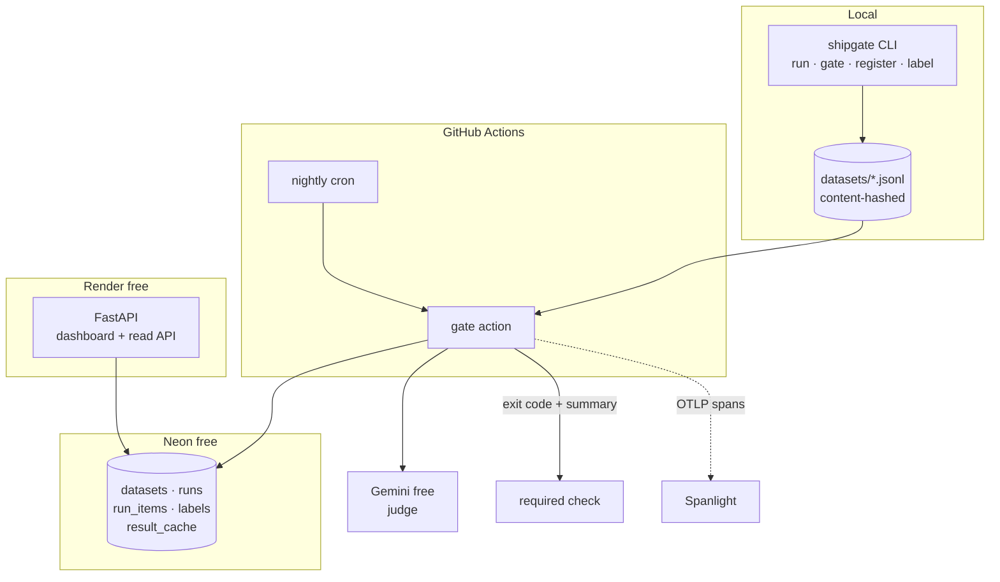

# ShipGate

The system that decides whether an AI change ships.

Versioned eval datasets, three runner types, a calibrated LLM judge, and a GitHub
Action that fails the check when quality regresses past a threshold. Runs entirely
on free tiers.

[Dashboard](https://shipgate-890d.onrender.com/) ·
[Adoption guide](docs/ADOPTING.md) ·
[Decisions](DECISIONS.md) ·
[What broke](LEARNING.md)

## Problem

Prompt and model changes ship on vibes. A change looks fine in three manual spot
checks, merges, and quietly breaks a slice of users nobody tested. The usual
answer, an eval script that prints a score, has two holes: nobody agrees what the
score means, and nothing stops the merge.

ShipGate closes both. Scores are anchored to a dataset version, and the gate is a
required check that exits non-zero.

The harder half is the judge. Grading open-ended output needs a model, and a model
grading a model is a noisy instrument with no obvious error bar. So the judge here
is measured against hand-labeled ground truth and reported with a kappa, before
anyone is asked to trust it to block a merge.

## Proof

**1. Judge calibration.** Agreement between the LLM judge and 100 hand-labeled
examples, across three rubric versions. Regenerate with
`uv run python scripts/calibrate.py --rubric v3`.

| Rubric | Kappa | Agreement | Disagreements | What it measured |
|---|---|---|---|---|
| v1, naive | 1.000 | 100% | 0 | nothing, see below |
| v2, judge blind | 0.861 | 95% | 5 | real judgement |
| v3, boundaries named | **0.921** | 97% | 3 | real judgement |

**v1 scoring 1.000 is the finding, not the success.** It was handed both the
expected intent and the prediction, so agreeing with a human applying strict
equality is trivial: `==` scores 1.000 on that task. It measured string
comparison. It is kept as the first row because a perfect score there is the
signal that the measurement is broken, and that is the more useful thing to
show.

v2 removes the expected answer, which is the situation in production: no ground
truth is the entire reason to want a judge. Four of its five disagreements were
one boundary, where the user's own account state is broken so the human said
`account` while the judge saw a malfunction and accepted `technical`. v3 names
that boundary and fixes all four.

**v3 is fitted to the test set.** It was written by reading v2's disagreements
and then scored on the same hundred items, so 0.921 is optimistic. Confirming it
needs items the rubric has not seen.

**The judge is too noisy to gate on.** Five runs over 20 identical items, nothing
changing between them:

| run | 1 | 2 | 3 | 4 | 5 | mean | stdev | spread |
|---|---|---|---|---|---|---|---|---|
| score | 0.80 | 0.75 | 0.85 | 0.65 | 0.75 | 0.760 | 0.074 | **0.200** |

The noise floor is 20 points while the gate's default threshold was 2. That
default would have fired on nearly every run of an unchanged model, and a gate
that cries wolf gets switched off while still wearing a green check. So the exact
runner carries the gate and the judge is advisory. Measured on
`llama-3.1-8b-instant`, because the 70B free tier cannot sustain repeated runs,
so 0.200 is an upper bound for the cheapest judge rather than a constant.

**How the labels were produced.** A second annotator produced candidate intent
labels independently, and every disagreement and borderline case was then decided
by hand (`scripts/import_annotations.py` builds that shortlist). Pass/fail labels
for calibration are mine. This is pre-annotation with human adjudication rather
than unassisted labeling, which is worth stating because it changes what the kappa
means: it is agreement between the judge and a human-adjudicated standard, not
between the judge and a blank-slate annotator.

Single annotator, so this is judge-versus-human agreement and not inter-annotator
agreement. A second independent human would give a ceiling to compare the judge
against, and there isn't one here.

**2. A regression, blocked.** Actions run
[30931868809](https://github.com/vinayakjeet/shipgate/actions/runs/30931868809):

```
## ShipGate: FAILED
overall score dropped 0.250 (threshold 0.020)

| metric         | baseline | current | delta  |
| overall        | 0.250    | 0.000   | -0.250 |
| intent:billing | 1.000    | 0.000   | -1.000 **regressed** |
| lang:hi        | 0.250    | 0.000   | -0.250 **regressed** |

- `sup-001` scored 0.00, output: 'unknown'
```

The same commit against a clean target passes. Same workflow, same database,
opposite verdicts.

## Architecture



**Runners.** `exact` for anything with a canonical answer, free and deterministic.
`judge` for open-ended output, where exact match cannot tell `billing` from
`this is a billing issue`. `pairwise` for preference between two candidates.

**Datasets** are content-addressed. The hash is order invariant, so reordering
rows does not invalidate a baseline, while editing any field does. Baselines are
scoped to the hash, because a score measured on different content is not
comparable.

**The cache** is keyed on every input that can change an outcome, including the
rubric version, and lives in Postgres rather than on disk because CI containers
start empty.

## Benchmarks

Regenerate with `uv run python scripts/benchmark.py`.

Measured 2026-08-05 on the free tier, 100-item support-intent dataset, against a
majority-class baseline target.

| target / runner | n | score | run-to-run spread | cost | errors |
|---|---|---|---|---|---|
| majority-class baseline, exact | 100 | 0.25 | 0 | $0.00 | 0 |
| llama-3.3-70b, exact | 100 | **0.75** | 0 | $0.00 | 0 |
| llama-3.3-70b, judge v3 | 100 | 0.74 | see note | $0.00 | 0 |
| llama-3.3-70b, judge v2 | 100 | 0.78 | see note | $0.00 | 0 |

0.25 is the correct score for a constant predictor on four balanced classes. It
is the floor any real model has to clear, and the reason the classes are balanced
at 25 each: on a skewed set a do-nothing predictor scores 0.60 and looks
respectable.

The 70B model reaches 0.75, and its errors have structure rather than being
noise. It over-triages: 19 of its 25 mistakes route to `technical` or `account`,
reading a broken unsubscribe link and a question about where the docs live as
technical problems.

| intent | accuracy |
|---|---|
| technical | 25/25 |
| billing | 22/25 |
| account | 17/25 |
| other | 11/25 |

**The spread column is the point of the table.** Exact match scores 0.75 and the
judge scores 0.74, close enough to look interchangeable. They are not. Exact match
returns the same answer every time; the judge moved 20 points across five runs on
identical inputs, measured separately on `llama-3.1-8b-instant` because the 70B
free tier cannot sustain repeats. Two runners agreeing on a number does not make
them equally trustworthy, and the one worth gating on is the one that does not
change its mind.

Note also that v2 and v3 score 0.78 and 0.74 while disagreeing with the human 5
and 3 times respectively. The rubric that scores higher is the less accurate one,
which is why the calibration table reports kappa rather than score.

**Free-tier limits, measured rather than read from docs.** Gemini allows 20
requests per rolling minute, and under an exhausted quota per-item latency was 55
seconds, essentially all of it waiting. Groq's binding limit on the 70B model is
tokens per minute rather than requests, so 400-token judge prompts exhaust it long
before the documented request ceiling, and the resulting wait measured 350
seconds. Both are in [QUOTAS.md](QUOTAS.md).

## Technical Decisions

Full log in [DECISIONS.md](DECISIONS.md). The four that shaped the design:

**Only real regressions block.** A missing baseline, or a run where a tenth of the
items failed to score, exits zero and complains loudly. Blocking a good change for
an infrastructure reason is how a gate gets bypassed, which costs more than the
one regression it might have caught.

**Per-slice guards, not just an average.** A model can hold 0.86 overall while one
language slice collapses to 0.60. The overall number is structurally blind to
that. The guard fires per slice and names the one that broke.

**Errors are counted separately from scores.** A failed item scores 0, so a run
full of judge errors is numerically identical to a real regression. Without a
separate error count, a JSON parsing bug reads as "the model got worse".

**Pairwise comparisons are judged twice, in both orders.** LLM judges prefer
whichever candidate appears first. Averaging both orderings means a consistent
judge scores 1.0 or 0.0, while a purely position-biased one contradicts itself and
lands on 0.5, which is the signal that the comparison is worthless.

## What Broke

Longer log in [LEARNING.md](LEARNING.md).

**The gate could not fail. Twice.** First, the CLI stored the current run before
resolving the baseline, so every run compared against itself and reported a delta
of exactly zero. After fixing that, a regression failed once and then passed,
because the failing run was still written to the baseline branch and became the
new bar. A gate that blocks a regression once and then blesses it is worse than no
gate, because the green check says everything is fine.

All 27 unit tests passed through both. They hand the comparison a baseline
directly, so they tested the arithmetic perfectly and never tested where the
baseline comes from. The second bug only appeared on the second run, so even a
single end-to-end check would have missed it.

**A migration that silently did nothing.** `create table if not exists` is
idempotent for creation, but on an existing table Postgres skips the entire
statement, new columns included. The test asserted that applying the file twice
does not crash, which was true and beside the point.

**The Gemini free tier does not behave like its documentation.** No `Retry-After`
header, with the delay stated only in prose inside the error body, so the client
fell back to a 5 second cooldown against a limit needing 49 and would have burned
quota indefinitely without succeeding. Token counts arrive split across fields
that do not add up, because reasoning tokens appear only in the total: a real
response read prompt 2, completion 9, total 197. And the configured model did not
exist for a new key at all.

## Run It

Requires [uv](https://docs.astral.sh/uv/) and a Postgres URL.

```bash
uv sync
cp .env.example .env      # add SHIPGATE_DB_URL, and GEMINI_API_KEY for the judge

# score a dataset
uv run python -m shipgate run --dataset datasets/support-intent.jsonl

# gate a change: compares against the baseline, exits 1 on regression
uv run python -m shipgate gate --dataset datasets/support-intent.jsonl

# watch it block
uv run python -m shipgate gate --dataset datasets/support-intent.jsonl \
  --target-label unknown

# hand-label for judge calibration
uv run python -m shipgate label --dataset datasets/support-intent.jsonl

# tests
uv run pytest && uv run ruff check .
```

The dashboard runs locally with `uv run uvicorn app.main:app --reload`.

Gating another project takes two files and one secret. See
[docs/ADOPTING.md](docs/ADOPTING.md).

## Scope

Not an experiment tracker, a labeling platform, a prompt registry, or a monitoring
system. It does not train models, and it never fixes a regression, it only refuses
to let one through. Full list of non-goals in [SPEC.md](SPEC.md).

The brief asked for ShipGate to gate Tollgate by end of build. Tollgate is built
five days later, so ShipGate gates itself instead and ships the adoption contract
each project follows on its own build day. Reasoning in
[DECISIONS.md](DECISIONS.md).
