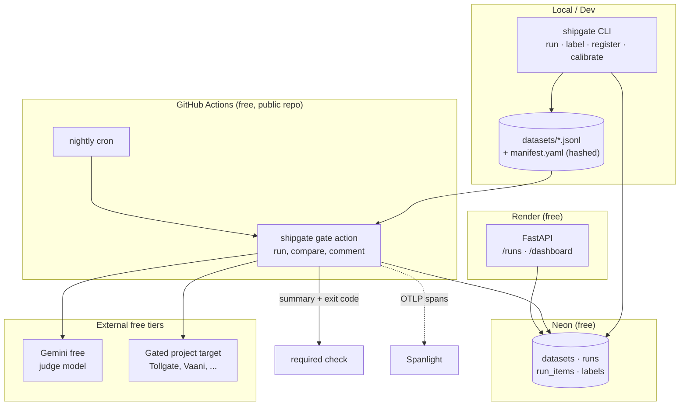

# ShipGate: SPEC

## Mission

ShipGate is the system that decides whether an AI change ships. It holds
versioned eval datasets, three runner types, a run store, and a GitHub Action
that reports score diffs and fails the check when a change regresses beyond
threshold. It is the quality gate the other ten portfolio projects are
judged by, and its own judge is calibrated against hand-labeled ground truth so
its verdicts are defensible rather than vibes.

## Proof Artifact

Two artifacts, both mandatory, both published in README:

1. **The calibration table.** Judge to human agreement (Cohen's kappa) on ~100
   hand-labeled examples, reported before and after rubric tuning, so the
   improvement is visible rather than asserted.

   | Rubric version | Kappa | Agreement % | n | Notes |
   |---|---|---|---|---|
   | v1 (naive "is this good?") | tbd | tbd | 100 | baseline |
   | v2 (tuned, criteria-split) | tbd | tbd | 100 | target >= 0.6 |

2. **A real change blocked by a regression.** Screenshot or video of the
   ShipGate check failing red on a real commit, with the job summary showing the
   score delta, the failing slice, and the worst newly-failing examples. These
   are solo repos worked on without pull requests, so the artifact is the failing
   required check rather than a blocked merge. The same check blocks a merge
   wherever PRs are in use.

The second artifact is the one that lands in interviews. The first is the one
that makes the second trustworthy.

---

## User-visible behavior

**S1. A regression turns the check red.**
*Given* a gated project with a green baseline on `main`,
*when* a prompt change drops overall score by 6% (threshold 2%),
*then* the ShipGate check fails, and the verdict summary shows overall delta, the
per-slice breakdown, and the 3 worst newly-failing examples.

**S2. Improvement passes and is visible.**
*Given* the same baseline,
*when* a change raises score by 4%,
*then* the check passes and the summary shows the positive delta with cost and
p50 latency alongside, so a "win" that tripled cost is still legible as a
tradeoff rather than a free win.

**S3. Noise does not block.**
*Given* a judge runner with known run-to-run variance,
*when* a change scores 1.1% below baseline and the threshold is 2%,
*then* the check passes and the summary explicitly labels the delta
`within-noise (threshold 2.0%)` rather than silently ignoring it.

**S4. A changed dataset invalidates the baseline.**
*Given* a stored baseline run against dataset hash `abc123`,
*when* the dataset is edited (hash becomes `def456`) and the gate runs,
*then* ShipGate refuses to compare across hashes, reports
`baseline invalid: dataset changed`, and requires a fresh baseline run on `main`
before it can gate again.

**S5. Free-tier rate limits degrade gracefully.**
*Given* the Gemini free tier at 15 rpm,
*when* a 100-item judge run exceeds that rate,
*then* the runner backs off and completes the full run without dropping items,
and the run record reports wall-clock time honestly rather than failing the check
for an infrastructure reason.

**S6. Re-running is cheap.**
*Given* a completed run for (dataset hash, target sha, runner, model),
*when* the identical run is requested again,
*then* cached per-item results are reused, the run completes in a fraction of
the time, and the run record marks `cache_hit_rate`.

**S7. A slice regresses while the average lies.**
*Given* a dataset sliced by `lang:hi` and `lang:en`,
*when* a change leaves overall score flat but drops `lang:hi` by 12%,
*then* the check fails on the per-slice guard and the summary names the slice.

**S8. Nightly runs show drift over time.**
*Given* the nightly cron enabled,
*when* I open the dashboard,
*then* I see score-over-time per dataset with cost and latency per run, so slow
drift is visible without anyone opening a PR.

---

## Non-goals

Scope creep dies here. We are **not** building:

1. **A general-purpose experiment tracker.** No W&B or MLflow equivalent, no
   arbitrary metric logging, no run comparison UI beyond score-over-time.
2. **A labeling platform.** Hand-labeling is a local CLI writing JSONL. No web
   UI, no multi-annotator workflow, no adjudication queue.
3. **Any model training or fine-tuning.** ShipGate evaluates. It never trains.
4. **Auth, RBAC, or multi-tenancy.** Single user, public-read dashboard, no
   login. Write paths are CI-token-gated only.
5. **Online production monitoring.** Live trace collection belongs to Spanlight.
   ShipGate is offline evals. Online judge sampling is STRETCH and dies first.
6. **A prompt registry or prompt-management system.** Prompts live in the gated
   project's repo. ShipGate only reads a target.
7. **Auto-remediation.** ShipGate blocks bad changes. It never proposes or
   applies fixes.
8. **Paid judge models.** Gemini free tier only. If the free tier cannot sustain
   the eval, the eval gets smaller. The budget does not grow.

---

## Architecture

Components and where they run:

| Component | Runtime | Free tier |
|---|---|---|
| `shipgate` CLI (`run`, `label`, `register`, `calibrate`) | local and CI | n/a |
| Dataset registry (JSONL plus `manifest.yaml`, content-hashed) | git | n/a |
| Runners (exact, judge, pairwise) | GitHub Actions runner | Actions free (public repo) |
| Judge model | Gemini API | free tier, 15 rpm |
| Run store | Postgres | Neon free |
| Dashboard and read API | FastAPI (chassis fork) | Render free |
| Gate action | composite GitHub Action | Actions free (public repo) |
| Tracing | OTLP to Spanlight | Grafana Cloud free |

Data flow: the CLI registers a hashed dataset into git. The gate action runs it
against the PR's target, writes per-item results and one run row to Neon,
compares against the baseline run for the same dataset hash on `main`, comments
the diff, and exits non-zero on regression. The dashboard reads Neon only.



---

## Integration contracts

### What ShipGate consumes from a gated project

Each gated project (Dastavez, Vaani, Nishana, Tollgate, Chakravyuh) commits a
`shipgate.yaml` and exposes one invocable target.

```yaml
# shipgate.yaml, in the gated project's repo root
version: 1
datasets:
  - id: tollgate-core
    path: evals/tollgate-core.jsonl
    runner: judge            # exact | judge | pairwise
    threshold_overall: 0.02  # fail if score drops more than 2 points absolute
    threshold_slice: 0.05    # fail if any slice drops more than 5 points
target:
  kind: http                 # http | cmd
  url: ${{ env.EVAL_TARGET_URL }}
```

Target contract, one request per dataset item:

```jsonc
// POST <target.url>
{ "input": { "prompt": "..." }, "item_id": "t-0041" }

// 200 OK
{ "output": "...",
  "meta": { "tokens_in": 412, "tokens_out": 88, "latency_ms": 940 } }
```

Dataset record, one JSON object per line:

```jsonc
{ "id": "t-0041",
  "input": { "prompt": "..." },
  "expected": "...",              // required for exact, optional for judge
  "slices": ["lang:hi", "len:short", "risk:pii"],
  "meta": {} }
```

### What ShipGate provides

The gate action is the only integration surface other projects touch:

```yaml
- uses: vinayakjeet/shipgate/action@v1
  with:
    config: shipgate.yaml
    dataset: tollgate-core
    baseline-ref: main
  env:
    SHIPGATE_DB_URL: ${{ secrets.SHIPGATE_DB_URL }}
    GEMINI_API_KEY: ${{ secrets.GEMINI_API_KEY }}
```

Action outputs: `score`, `baseline_score`, `delta`, `verdict`
(`pass | fail | baseline-invalid`), `run_id`.

Read API (public, served from Render):

```jsonc
// GET /api/runs?dataset=tollgate-core&limit=50
{ "runs": [
  { "run_id": "r_01H...", "dataset_id": "tollgate-core",
    "dataset_hash": "sha256:abc123", "git_sha": "9f2c...",
    "runner": "judge", "model": "gemini-2.0-flash",
    "score": 0.86, "n": 100,
    "slices": { "lang:hi": 0.79, "lang:en": 0.91 },
    "cost_usd": 0.0, "p50_latency_ms": 940,
    "cache_hit_rate": 0.62, "started_at": "2026-08-05T02:00:00Z" } ] }
```

To Spanlight, ShipGate emits OTLP spans with no custom protocol:

| Span | Key attributes |
|---|---|
| `shipgate.run` | `dataset_id`, `dataset_hash`, `runner`, `git_sha`, `n`, `score` |
| `shipgate.item` | `item_id`, `slices`, `cache_hit`, `latency_ms` |
| `shipgate.judge` | `model`, `rubric_version`, `tokens_in/out`, `verdict` |

**Dogfooding note.** The DoD line "evaluated via ShipGate where applicable" is
self-referential here, because ShipGate gates the *other* projects. It satisfies
this by gating its own PRs with its own action, using the judge-calibration
dataset as its eval. If ShipGate's own gate cannot block a ShipGate regression,
it does not ship.

---

## Definition of Done

- [ ] **Deployed.** Dashboard live on a public Render URL, cold-start verified
      from a clean browser (incognito, no cache).
- [ ] **Runnable.** `uv run python -m shipgate run --config shipgate.yaml --dataset X`
      works from a fresh clone with only `SHIPGATE_DB_URL` and `GEMINI_API_KEY`.
- [ ] **Proof Artifact 1.** Calibration table (kappa before and after tuning,
      n ~ 100) in README, with the labeled set committed.
- [ ] **Proof Artifact 2.** Screenshot or video of a real PR blocked by a real
      regression, in README.
- [ ] **Instrumented with Spanlight.** Run, item, and judge spans visible in
      Grafana.
- [ ] **Self-gated.** ShipGate's own repo runs the ShipGate action on every
      push to the default branch.
- [ ] **Adoptable.** The consumer contract is published and proven by
      ShipGate gating its own PRs. Wiring each gated project happens in that
      project's build window (see DECISIONS.md).
- [ ] **Nightly cron** green for at least 2 consecutive nights.
- [ ] **Docs.** README sections filled, DECISIONS.md complete, architecture
      diagram exported, 6-bullet video script written.

---

## Interview checkpoints

Verbatim from the brief. These are learning gates. Each milestone's Learning
Checkpoint in BACKLOG.md draws from them, and I must be able to answer them
without notes before the project is considered done.

1. **how I know my judge is right**
2. **eval noise vs. real regression (and my threshold logic)**
3. **offline evals vs. online monitoring split**
4. **how eval sets rot and my refresh policy**

---

## Decisions (confirmed)

| # | Decision | Consequence |
|---|---|---|
| D1 | Full scope funded, ~35h over ~4.5 days. No cuts at plan time. | Every MUST in the brief is scheduled, including all three runner types, parallelism, the dashboard, and nightly cron. The Cut Line in BACKLOG.md is insurance against overrun, not a planned reduction. |
| D2 | Repo is `vinayakjeet/shipgate`, public, forked from the chassis with history intact. | GitHub Actions minutes are free and unmetered, so nightly cron across every dataset costs nothing and the blocked-PR artifact is publicly verifiable. The chassis template stays pristine for the remaining projects. |
| D3 | Hand-labeling (M5.2) is done personally, ~90 min, blind to judge output, in two sittings. | Proof Artifact 1 rests on ground truth that is genuinely mine. The one task that cannot be automated. |
| D4 | No AI attribution anywhere in any of the 11 repos. No co-author trailers, no em dashes, no machine-generated cadence in tracked files. Agent instruction files stay gitignored. | Conventions live in CONTRIBUTING.md. Applies to commits, docs, and code comments, not just README. |

## Assumptions

Recorded because the brief did not specify them. Flag any you disagree with and
the plan changes.

| # | Assumption | Why it matters |
|---|---|---|
| A1 | Judge model is `gemini-2.0-flash` on the free tier (15 rpm), per the chassis `quotas.yaml`. | Sets run wall-clock and forces caching and backoff as MUST, not polish. |
| A2 | Baseline is the most recent successful run on `main` for the same dataset hash. No cross-hash comparison, ever. | Makes S4 well defined and kills a whole class of false verdicts. |
| A3 | Default thresholds are 2% absolute overall and 5% absolute per slice, placeholders until real variance is measured in M5.6. | Prevents a guessed number from silently becoming permanent. |
| A4 | Calibration target is kappa >= 0.6 (substantial agreement) after tuning. Below that, the judge is not trusted to gate. | Defines success for the primary Proof Artifact. |
| A5 | Neon free tier autosuspends. Cold starts on the dashboard are accepted and documented, not engineered around. | Avoids burning budget on a non-problem. |
| A6 | Dashboard is server-rendered HTML from the existing FastAPI app. No separate frontend build, no SPA. | Saves ~4h even at full budget, spent on evals instead. |
| A7 | Calibration is done on one dataset, ~100 items, single annotator, using pre-annotation with human adjudication of every disagreement and borderline case. | Single-annotator kappa is judge vs human, not inter-human, and the standard is human-adjudicated rather than unassisted. Both are stated openly in the README, since they change what the number means. |
| A8 | The public repo contains no secrets. DB URL and API keys live only in `.env` locally, GitHub Actions secrets, and Render env vars. | A public repo makes this non-negotiable rather than merely good practice. |
